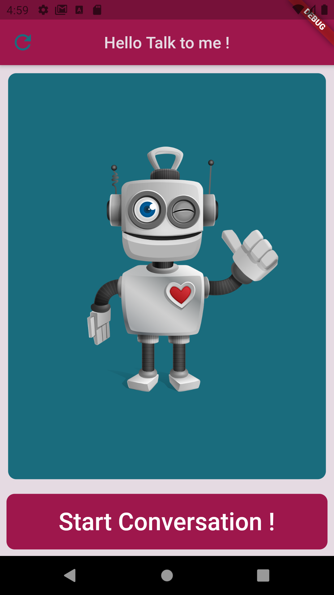

# FlutterChatbot

To start conversation click - Start Conversation ! \
if any unexcepted behavior accure - click refresh (found at the top left) 

packages used : 
 
https://pub.dev/packages/speech_to_text \
https://pub.dev/packages/ibm_watson_assistant \
https://pub.dev/packages/flutter_tts 

 

